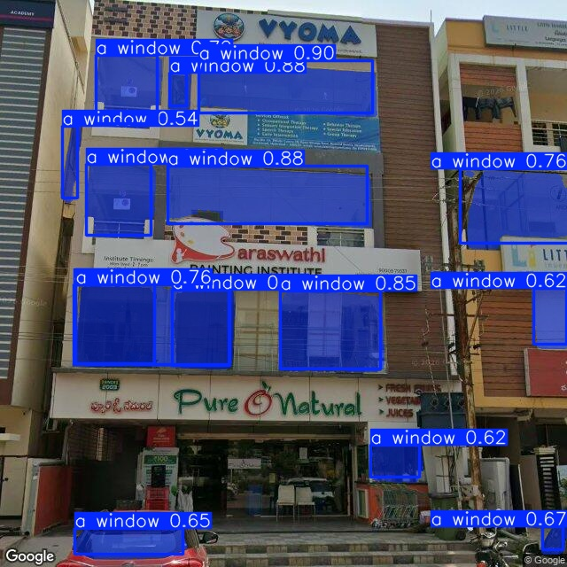

# Street-Level Building Intelligence from Google Street View
Technical Assignment Submission for Geokno India Pvt. Ltd.

Role: Senior Data Scientist

## Overview

### This project implements an end-to-end Street-Level Building Intelligence Pipeline that:

- Scrapes Google Street View imagery
- Associates each image with a building footprint
- Extracts building-level attributes using computer vision
- Visualizes results on an interactive map

### The system is designed for representative streets in:

Gachibowli
Hyderabad, India

### The final output is an interactive browser-based application where users can click a building and inspect:

- Street View image
- Estimated floor count
- Estimated façade area
- Property type classification
- Other Meta data

## Project Architecture

                ┌─────────────────────┐
                │ Input Coordinates   │
                └─────────┬───────────┘
                          │
                          ▼
            ┌────────────────────────┐
            │ Download Street View   │
            │ Imagery                │
            └─────────┬──────────────┘
                      │
                      ▼
              ┌─────────────────────┐
              │ Fetch Building OSM  │
              │ Footprints          │
              └─────────┬───────────┘
                        │
                        ▼
             ┌──────────────────────┐
             │ Compute Camera       │
             │ Heading & Alignment  │
             └─────────┬────────────┘
                       │
                       ▼
           ┌──────────────────────────┐
           │ CV-Based Attribute       │
           │ Extraction               │
           └─────────┬────────────────┘
                     │
                     ▼
           ┌──────────────────────────┐
           │ Interactive Map          │
           │ Visualization            │
           └──────────────────────────┘

## Setup Instructions

### 1. Clone the Repository

```bash
git clone https://github.com/zubair9703/geokno_assignment.git
cd geokno_assignment
```

### 2. Install Dependencies

```bash
pip install -r requirements.txt
```

### 3. Running the Pipeline (For interactive UI)

```bash
streamlit run src/app.py
```

### 4. For a Notebooks based demo use the following file

```bash
demo.ipynb
```
### - Note inorder to run the above pipeline SAM3 weights should be downloaded from huggingface repo and same to be updated in config file.

## Limitations of the proposed solution

1. Google Street View Coverage

- Some streets may:

  - Lack imagery
  - Have outdated imagery
  - ontain low-resolution captures

2. Occlusion Issues

- Objects like:

    - Trees
    - Cars
    - Utility poles

3. Camera Geometry Variability
Selecting an optimal pitch and FOV is difficult

4. Building Footprint Misalignment

5. Perspective Distortion

6. Need for Automated Image Ranking

## Design Decisions

1. Why OpenStreetMap?

- Used for:

    - Free building footprints
    - Accurate geometry
    - Easy GeoPandas integration

2. Why Google Street View?

- Provides:

  - Real-world façade imagery
  - Dense urban coverage
  - Consistent metadata

3. Why Segment Anything Model (SAM) Was Used

    For façade understanding and building-region extraction, the pipeline leverages a SAM-based segmentation workflow because it proved significantly more robust compared to traditional object detection approaches such as:

    - YOLO
    - Grounding DINO
    - Generic object detectors

    SAM3 generalised very well on GSV images without any fine tuning

## Sample out of SAM3



